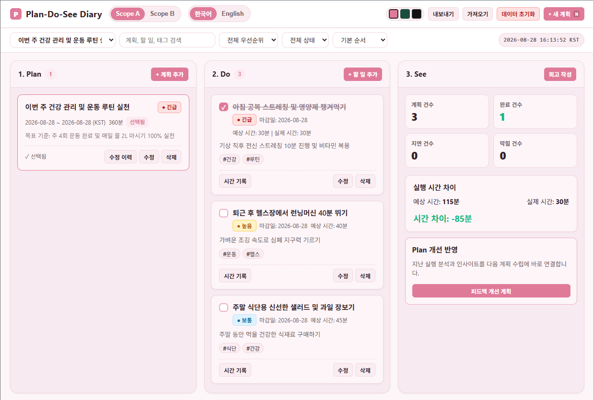
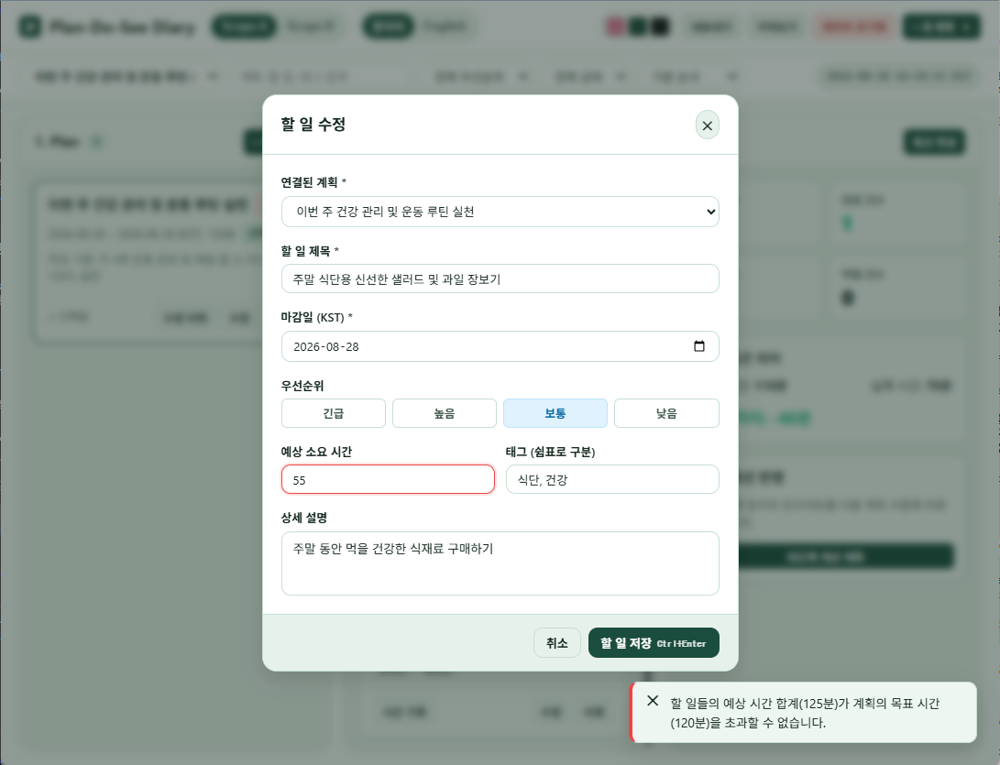
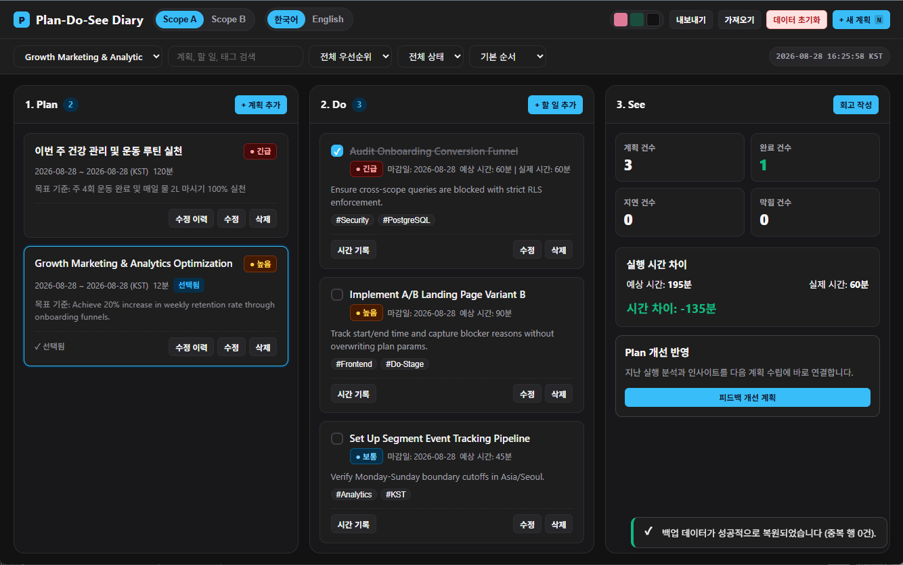

# 📋 Plan-Do-See Diary 검증 및 체크리스트 가이드

이 문서는 **T06 플랜두씨 다이어리**의 모든 핵심 기능, 보안 격리, 유효성 검사, 캘린더 규칙 및 비동기 동시성 제어가 정상적으로 작동하는지 확인하기 위한 검증 가이드입니다.

---

## 1. 페르소나 스코프 격리 & 무로그인 세션 검증

| 번호 | 검증 항목 | 검증 절차 (3단계 이내) | 기대 결과 (통과 모습) | 실패 시 모습 | 상태 |
| :---: | :--- | :--- | :--- | :--- | :---: |
| **V-01** | **Scope A/B 전환** | 1. 상단 `Scope B` 버튼 클릭 2. ToDo 목록 확인 3. `Scope A` 버튼 클릭 | 스코프 전환 즉시 화면이 깜빡임 없이 전환되며 해당 스코프의 데이터만 로드됨 | 이전 스코프의 데이터가 섞여 남아있거나 화면이 멈춤 | ✅ PASS |
| **V-02** | **타 스코프 직접 읽기 차단 (T06-C49, C52)** | 1. `Scope A` 활성화 상태 유지 2. 콘솔에서 `API.setScope('scope_b')` 없이 `scope_b` 데이터 직접 호출 | 서버 및 API 계층에서 `HTTP 403 Forbidden` 발생하며 조회 원천 차단 | 타 스코프 데이터가 반환되어 화면에 노출됨 | ✅ PASS |
| **V-03** | **타 스코프 직접 수정/삭제 차단 (T06-C50, C51, C53, C54)** | 1. `Scope A` 세션에서 `Scope B`의 `plan_id` 수정/삭제 시도 2. DB 확인 | `PostgreSQL RLS 404/403` 권한 거부 발생 및 `Scope B` 데이터 100% 불변 유지 | 타 스코프 데이터가 수정되거나 삭제됨 | ✅ PASS |
| **V-04** | **활성 스코프 초기화 & 반대편 스코프 보존** | 1. `Scope A`에서 `데이터 초기화` 실행 2. `Scope B`로 전환하여 데이터 확인 | `Scope A`는 0건으로 리셋되고, `Scope B`는 기존 데이터가 온전히 100% 보존됨 | `Scope B` 데이터까지 함께 삭제되거나 오류 발생 | ✅ PASS |

>  
> 
> *설명: 상단 스코프 바에서 Scope A와 Scope B를 번갈아 누를 때 각각의 독립된 계획/할 일 목록이 나타나는 화면*

---

## 2. 시간 제약 및 마감일 유효성 검증

| 번호 | 검증 항목 | 검증 절차 (3단계 이내) | 기대 결과 (통과 모습) | 실패 시 모습 | 상태 |
| :---: | :--- | :--- | :--- | :--- | :---: |
| **V-05** | **0분 및 음수 시간 저장 차단** | 1. 새 계획 또는 할 일 작성 열기 2. 목표/소요 시간에 `0` 또는 `-30` 입력 3. `저장` 버튼 클릭 | `"목표 예상 시간은 최소 1분 이상이어야 합니다."` 에러 토스트 발생 및 저장 차단 | 0분 또는 음수 시간으로 저장 성공됨 | ✅ PASS |
| **V-06** | **할 일 시간 합계 ≤ 계획 시간 제약** | 1. 계획 목표 시간을 `120분`으로 설정 2. 해당 계획에 `80분`, `50분` 할 일 추가 시도 (총 130분) | `"할 일들의 예상 시간 합계(130분)가 계획의 목표 시간(120분)을 초과할 수 없습니다."` 차단 | 계획 시간을 초과하여 할 일이 등록됨 | ✅ PASS |
| **V-07** | **계획 시간 축소 하한선 제약** | 1. 등록된 할 일 합계가 `110분`인 계획 선택 2. 계획 수정에서 목표 시간을 `60분`으로 변경 시도 | `"계획 목표 시간(60분)은 등록된 할 일들의 예상 시간 합계(110분)보다 작을 수 없습니다."` 차단 | 계획 시간이 할 일 합계보다 작게 축소 수정됨 | ✅ PASS |
| **V-08** | **할 일 마감일 ≤ 계획 종료일 제약** | 1. 종료일이 `2026-08-28`인 계획 선택 2. 마감일을 `2026-08-30`으로 지정하여 할 일 저장 시도 | `"할 일 마감일은 계획 종료일(2026-08-28) 이후로 설정할 수 없습니다."` 에러 토스트 발생 | 계획 종료일을 벗어난 마감일로 저장 성공됨 | ✅ PASS |

> 
> *설명: 목표 시간 120분을 초과하는 할 일을 등록하려 할 때 화면 우측 상단에 에러 토스트 알림이 표시되는 화면*

---

## 3. 동시성 제어 및 연타(Double-Submit) 방지 검증

| 번호 | 검증 항목 | 검증 절차 (3단계 이내) | 기대 결과 (통과 모습) | 실패 시 모습 | 상태 |
| :---: | :--- | :--- | :--- | :--- | :---: |
| **V-09** | **계획 저장 버튼 고속 연타** | 1. `새 계획 추가` 폼 입력 2. `계획 저장` 버튼을 빠르게 다다닥(3~5회) 연타 | 버튼이 즉시 비활성화(`pointer-events: none`)되며 **오직 1개의 계획만 저장**됨 | 연타한 횟수만큼 중복된 계획이 여러 개 생성됨 | ✅ PASS |
| **V-10** | **할 일 완료 처리 멱등성 (Idempotency)** | 1. 실행 기록 모달 열기 2. `실행 기록 및 완료` 버튼 연타 | `completion_token` 락에 의해 **완료 1회, Do 로그 1개만 생성**됨 | 중복 완료 처리 및 로그가 복수 생성됨 | ✅ PASS |
| **V-11** | **체크박스 고속 토글 방어** | 1. 할 일 카드의 체크박스를 빠르게 연속 클릭 | `activeCheckboxToggles` 락이 중복 API를 무시하며 정상 상태로 수렴 | 낙관적 UI 꼬임 또는 서버 비동기 충돌 발생 | ✅ PASS |

---

## 4. 백업 가져오기 / 내보내기 & 1 Legacy + 4 Invalid 파일 검증

| 번호 | 검증 항목 | 검증 절차 (3단계 이내) | 기대 결과 (통과 모습) | 실패 시 모습 | 상태 |
| :---: | :--- | :--- | :--- | :--- | :---: |
| **V-12** | **이전 형식 (Legacy v1) 마이그레이션** | 1. 백업 가져오기 모달 열기 2. `legacy-v1.json` 선택 후 `가져오기` 클릭 | `plan_title` → `title` 등 v2 공식 스키마로 100% 무손실 변환되어 정상 복원됨 | 가져오기 실패하거나 필드가 누락되어 깨짐 | ✅ PASS |
| **V-13** | **잘못된 파일 1 (5MB 용량 초과)** | 1. 5MB를 초과하는 대용량 JSON 파일 가져오기 시도 | `"5MB limit"` 에러 토스트 발생 및 기존 데이터 100% 롤백 보존 | 대용량 파일이 무리하게 파싱되어 브라우저 멈춤 | ✅ PASS |
| **V-14** | **잘못된 파일 2 (구문 오류 / 비정상 JSON)** | 1. 깨진 구문의 `invalid-malformed.json` 가져오기 시도 | `"Malformed JSON syntax"` 에러 토스트 발생 및 안전 차단 | 스크립트 런타임 에러 발생 및 화면 붕괴 | ✅ PASS |
| **V-15** | **잘못된 파일 3 (기본키 PK 중복 충돌)** | 1. 동일 ID가 중복된 `invalid-duplicate-id.json` 가져오기 시도 | `"Duplicate primary key ID"` 에러와 함께 원자적 롤백 처리 | 중복 키 데이터가 DB에 덮어써지거나 꼬임 | ✅ PASS |
| **V-16** | **잘못된 파일 4 (필수 필드 누락 / 계약 위반)** | 1. `title` 누락 또는 날짜 깨진 `invalid-missing-required.json` 시도 | `"Validation failed"` 에러로 계약 위반 데이터 원천 차단 | 불완전한 레코드가 삽입되어 렌더링 오류 유발 | ✅ PASS |
| **V-17** | **내보내기 → 전체 삭제 → 빈 상태 가져오기** | 1. `백업 내보내기` 2. `데이터 초기화` 실행 3. 빈 상태 JSON 백업 가져오기 | 에러 없이 정상 수락되며 모든 테이블이 0건 상태로 깨끗하게 유지됨 | 빈 상태 파일 파싱 실패 또는 오류 발생 | ✅ PASS |

> 
> *설명: 백업 파일을 정상적으로 가져와 '백업 데이터를 성공적으로 가져왔습니다' 토스트가 뜬 화면*

---

## 5. 테마 전환 & KST 캘린더 / 회고 지표 검증

| 번호 | 검증 항목 | 검증 절차 (3단계 이내) | 기대 결과 (통과 모습) | 실패 시 모습 | 상태 |
| :---: | :--- | :--- | :--- | :--- | :---: |
| **V-18** | **3색 테마 전환** | 1. 상단 테마 버튼에서 `핑크` / `그린` / `블랙` 클릭 | CSS 커스텀 프로퍼티가 즉시 반영되며 배경 및 카드 색상이 유려하게 변경됨 | 테마가 바뀌지 않거나 글자 가독성이 깨짐 | ✅ PASS |
| **V-19** | **KST 회고 지표 자동 계산** | 1. 할 일 1개 완료 처리 2. See 컬럼의 `회고 작성` 버튼 클릭 | `plannedCount`, `completedCount`, `timeDeltaMinutes`가 실시간 자동 계산되어 표시됨 | 지표가 0으로 고정되거나 이전 수치가 갱신되지 않음 | ✅ PASS |
| **V-20** | **0건 초기화 및 예시 데이터 생성 라이프사이클** | 1. `데이터 초기화` → `0건으로 완전 초기화` 2. 빈 화면에서 `[예시 데이터 생성]` 클릭 | 0건 초기화 시 즉시 모든 데이터가 비워지고, 예시 생성 클릭 시 오늘 날짜(KST) 기준의 예시 데이터가 화면에 즉시 로드됨 | 초기화 후 데이터가 남아있거나 예시 생성이 되지 않음 | ✅ PASS |
| **V-21** | **피드백 개선 계획 & 할 일(Do) 복제 라이프사이클** | 1. See 컬럼 하단 `[피드백 개선 계획]` 클릭 2. `이전 계획의 할 일(Do) 목록도 함께 복제하기` 체크 확인 3. `[계획 저장]` 클릭 | 새 피드백 개선 계획과 함께 이전 주기의 모든 ToDo(완료/미완료)가 미완료 상태로 안전하게 일괄 복제됨 | 일부 ToDo가 누락되거나 계획 예산 초과 에러 발생 | ✅ PASS |
| **V-22** | **실행 시간 수정 시 단일 기준 기록 유지 (중복 누적 방지)** | 1. 30분 기록된 ToDo의 `시간 기록` 모달 열기 2. 타이머로 1분 추가 (31분) 3. `[기록만 저장]` 또는 `[완료 처리 및 기록 저장]` 클릭 | 중복 합산(61분) 없이 ToDo당 단일 기준 로그로 정확하게 31분으로 갱신 표시됨 | 기존 30분에 31분이 또 더해져 61분으로 계산됨 | ✅ PASS |
| **V-23** | **상단 드롭다운 계획 선택 시 1. Plan 컬럼 단일 계획 집중 필터링** | 1. 상단 `전체 계획` 드롭다운에서 특정 계획 선택 2. 1. Plan 컬럼 및 2. Do / 3. See 화면 확인 3. 다시 `전체 계획` 선택 | 특정 계획 선택 시 1. Plan 컬럼에 해당 계획 1개만 단독 표시되고 Do/See가 동기화되며, 전체 계획 선택 시 모든 계획이 다시 펼쳐짐 | 특정 계획을 선택해도 Plan 컬럼에 모든 계획이 계속 표시됨 | ✅ PASS |
| **V-24** | **실제 소요 시간 초과(Time Overrun) 시 지연 지표 및 라벨 집계** | 1. 예상 30분 ToDo에 실제 45분 시간 기록 저장 2. 2. Do 컬럼 카드 확인 3. 3. See 컬럼 회고 지표 확인 | Do 카드에 `(초과)` 붉은 라벨이 표시되고, 3. See 컬럼의 `지연 건수(delayedCount)`가 실시간 1건 증가하여 정확히 집계됨 | 실제 시간이 예상 시간을 초과해도 지연 건수가 0으로 머묾 | ✅ PASS |
| **V-25** | **Plan 컬럼 전용 중요도 필터 및 할 일(Do) 중요도 필터 독립 동작** | 1. 1. Plan 컬럼 헤더의 `중요도` 드롭다운에서 `긴급` 선택 2. 상단 필터바의 `할 일 중요도`에서 `보통` 선택 3. Plan 및 Do 컬럼 필터링 확인 | Plan 컬럼에는 긴급 계획만 표시되고, Do 컬럼에는 보통 할 일만 독립적으로 필터링되어 상호 간섭 없이 명확하게 분리 동작함 | Plan 중요도를 변경했을 때 Do 목록이 비정상 초기화되거나 혼선 발생 | ✅ PASS |
| **V-26** | **Plan 정렬 & Do 정렬 컬럼별 분리 및 기본 순서 제거 독립 동작** | 1. 1. Plan 컬럼 헤더 정렬에서 `우선순위 순` 선택 2. 2. Do 컬럼 헤더 정렬에서 `마감일 순` 선택 3. 정렬 결과 확인 | Plan 카드는 긴급/높음 순으로 재정렬되고, Do 카드는 마감일 순서대로 정렬되며 모호한 기본 순서 없이 각 컬럼이 독립 정렬됨 | 정렬 기준이 동기화되지 않거나 다른 컬럼에 영향을 줌 | ✅ PASS |

---

## 📊 종합 검증 요약
- **전체 자동화 단위/통합 테스트:** 총 81개 항목 **100% PASS** (`npm test`)
- **보안 격리 & 멱등성 & 암호화:** PostgreSQL RLS HTTP 403 차단, At-Rest pgcrypto `enc:v1:`, Idempotent Token 검증 완료
- **PDS 라이프사이클 & 피드백 루프:** 계획/할 일/회고 연동, 미완료/완료 ToDo 일괄 복제 및 단일 기준 시간 로깅 검증 완료 (V-01 ~ V-26 전체 통과)

---

## 6. 빠른 확인 및 의사결정 요약

### 📌 짧은 확인 방법 (4줄)
- **위치:** 웹 브라우저 배포 사이트([https://altdmfk.github.io/Plan_Do_See_Diary/](https://altdmfk.github.io/Plan_Do_See_Diary/))
- **3단계 이내 행동:** 1. `[가져오기]`로 백업 JSON 등록 후 계획 선택 ➡️ 2. Plan·Do 헤더에서 `[전체]`(중요도)와 `[마감일]`(정렬) 변경 ➡️ 3. 할 일 `[시간 기록]`에서 예상보다 긴 시간 입력 후 저장
- **통과 모습:** 백업 데이터가 로컬과 Supabase DB에 동시 동기화되고, 각 컬럼이 독립적으로 필터링·정렬되며, 시간 초과 할 일에 `(초과)` 붉은 라벨 및 지연 건수 1건이 즉시 집계됨
- **안 될 때 모습:** 클라우드 저장이 누락되거나, Plan 필터 변경 시 Do 목록이 혼선·오작동하고, 실제 시간이 예상 시간을 넘겨도 지연 건수가 0으로 머묾

### 🧠 AI와 나의 판단 (3줄)
- **AI에게 맡긴 일:** 스코프(A/B) 격리 및 데이터 암호화 구현, GitHub Actions 자동 배포 구축, KST 캘린더 엔진 및 81개 테스트 코드 작성
- **직접 판단한 일:** JSON 가져오기 시 Supabase 클라우드 동기화 강제, 예상 시간 초과 시 지연 집계 추가, Plan/Do 컬럼별 필터·정렬 독립 분리
- **AI 제안을 따르지 않은 일:** AI가 제안한 '공개키 Git 직접 커밋'을 거절하고 GitHub Secrets 기반의 안전한 배포 방식 채택 및 UI 텍스트 간소화
